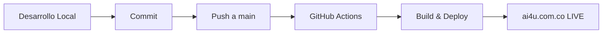

# Guía de Migración de Branches y GitHub Pages

Esta guía documenta el proceso de migración de la estrategia de branches y deployment del proyecto AI4U Website.

## Situación Anterior

El proyecto tenía múltiples branches con problemas de sincronización:
- `main`: Branch por defecto, desactualizada
- `master`: Branch activa con trabajo reciente, desincronizada
- `gh-pages`: Branch de deployment manual, desactualizada

## Nueva Estrategia

### Branches

- **`main`**: Única rama de desarrollo y producción
  - Branch protegida
  - Deploy automático mediante GitHub Actions
  - Estándar moderno de GitHub

### Deployment

- **Automático**: GitHub Actions ejecuta deploy en cada push a `main`
- **Manual**: Disponible como backup mediante `npm run deploy:manual`

## Pasos de Migración

### 1. Consolidar Cambios en `main`

Si tienes trabajo en `master` que no está en `main`:

```bash
# Asegúrate de estar en main
git checkout main

# Trae los cambios de master
git merge master

# O si prefieres un merge más limpio
git merge --no-ff master -m "Merge master into main: consolidación de branches"
```

### 2. Configurar GitHub Pages

1. Ve a **Settings → Pages** en tu repositorio
2. En **Source**, selecciona **GitHub Actions**
3. Verifica que el dominio personalizado esté configurado: `ai4u.com.co`
4. Activa **Enforce HTTPS**

### 3. Configurar Branch Protection (Opcional pero Recomendado)

1. Ve a **Settings → Branches**
2. Agrega una regla para `main`:
   - **Require pull request reviews before merging** (opcional)
   - **Require status checks to pass before merging**
     - Selecciona `build` del workflow de GitHub Actions
   - **Require branches to be up to date before merging**

### 4. Limpiar Branches Obsoletas

Una vez que `main` esté actualizada y el deploy automático funcione:

```bash
# Eliminar branch gh-pages localmente (ya no necesaria)
git branch -d gh-pages

# Eliminar branch gh-pages en remoto
git push origin --delete gh-pages

# Opcional: Eliminar master después de migración completa
# git branch -d master
# git push origin --delete master
```

**Nota:** Asegúrate de que todo el trabajo importante esté en `main` antes de eliminar branches.

### 5. Verificar Deploy Automático

1. Haz un cambio pequeño en `main` (ej: actualizar README)
2. Haz commit y push:
   ```bash
   git add .
   git commit -m "test: verificar deploy automático"
   git push origin main
   ```
3. Ve a **Actions** en GitHub y verifica que el workflow se ejecute correctamente
4. Espera 1-2 minutos y verifica que el sitio esté actualizado en `https://ai4u.com.co`

## Estructura del Workflow

El workflow de GitHub Actions (`.github/workflows/deploy.yml`) incluye:

1. **Trigger**: Push a `main` o ejecución manual
2. **Build Job**:
   - Checkout del código
   - Setup de Node.js 20 con caché
   - Instalación de dependencias (`npm ci`)
   - Validación de traducciones
   - Build de producción (`npm run build`)
   - Upload del artefacto
3. **Deploy Job**:
   - Deploy automático a GitHub Pages
   - Preservación del dominio personalizado

## Troubleshooting

### El deploy no se ejecuta

- Verifica que el workflow esté en `.github/workflows/deploy.yml`
- Verifica que GitHub Pages esté configurado para usar GitHub Actions
- Revisa los logs en **Actions** para ver errores

### El sitio no se actualiza

- Verifica que el build haya sido exitoso
- Espera 1-2 minutos (GitHub Pages puede tener delay)
- Verifica que el dominio personalizado esté configurado correctamente
- Revisa que el archivo `CNAME` esté en `public/CNAME`

### Errores de build

- Revisa los logs del workflow en **Actions**
- Ejecuta `npm run build` localmente para reproducir el error
- Verifica que todas las dependencias estén instaladas

## Beneficios de la Nueva Estrategia

1. **Automatización completa**: Sin comandos manuales
2. **Branch única**: Menos confusión, flujo claro
3. **CI/CD moderno**: Validación automática antes de deploy
4. **Historial**: Todos los deployments quedan registrados en GitHub
5. **Performance**: Caché de dependencias, builds rápidos
6. **Seguridad**: Protected branches, validaciones automáticas

## Flujo de Trabajo Diario



## Referencias

- [GitHub Actions Documentation](https://docs.github.com/en/actions)
- [GitHub Pages Documentation](https://docs.github.com/en/pages)
- [Vite Deployment Guide](https://vitejs.dev/guide/static-deploy.html)

