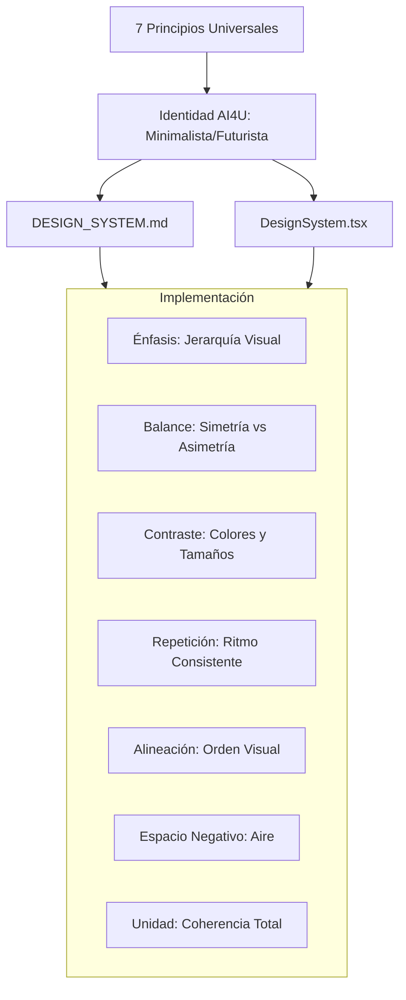

## Renovación y Aplicación del Sistema de Diseño AI4U

Este plan consiste en formalizar y aplicar los 7 principios universales del buen diseño (Énfasis, Balance, Contraste, Repetición, Alineación, Espacio Negativo y Unidad) en todo el sitio, actualizando la documentación y la página del sistema de diseño para que sirva como una guía interactiva y consistente.

### Estrategia de Implementación

1.  **Documentación Maestra de Diseño**:
    *   Actualizar `[src/docs/DESIGN_SYSTEM.md](src/docs/DESIGN_SYSTEM.md)` integrando los 7 principios explicados por el usuario.
    *   Traducir estos principios a la estética **AI4U Minimalista** (uso de blanco, negro, gris y acentos mínimos).

2.  **Página de Sistema de Diseño (Living Styleguide)**:
    *   Rediseñar `[src/pages/DesignSystem.tsx](src/pages/DesignSystem.tsx)` para que sea un recorrido educativo por los principios.
    *   Cada sección (Énfasis, Balance, etc.) tendrá un ejemplo visual usando los átomos de la carpeta `[src/components/shared/ui/atoms/](src/components/shared/ui/atoms/)`.

3.  **Refactor de Armonía y Ritmo**:
    *   Asegurar que el **Espacio Negativo (Aire)** sea consistente usando los tokens de `[src/components/shared/ui/tokens/spacing.ts](src/components/shared/ui/tokens/spacing.ts)`.
    *   Verificar la **Alineación** en el Bento Grid de la Home (`[src/pages/Home.tsx](src/pages/Home.tsx)`).

4.  **Ejemplos Reales y Accesibles**:
    *   Crear una sección de "Casos de Aplicación" donde se vea cómo el **Contraste** y el **Énfasis** guían al usuario hacia el `DiagnosticCTA`.

### Arquitectura del Sistema

